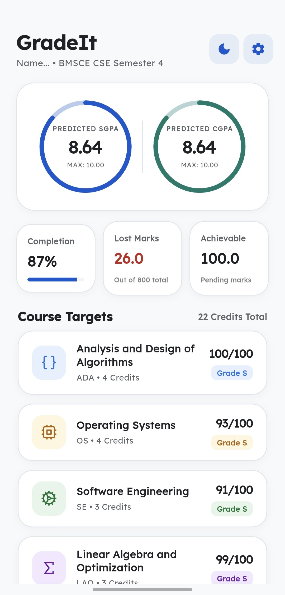
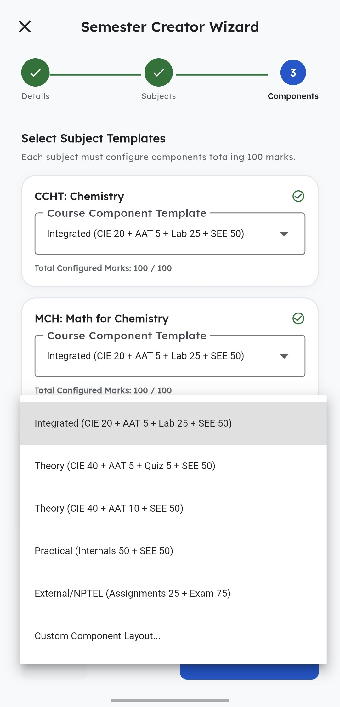
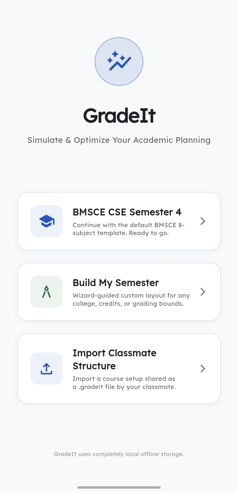
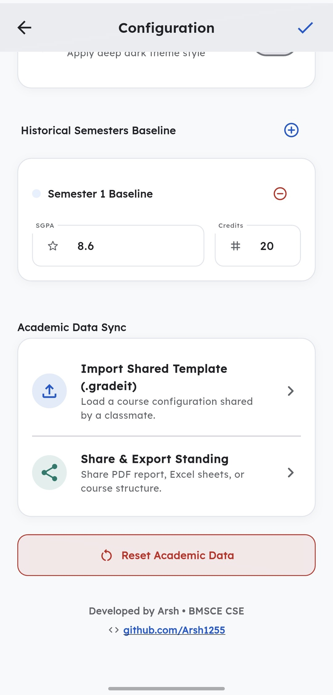
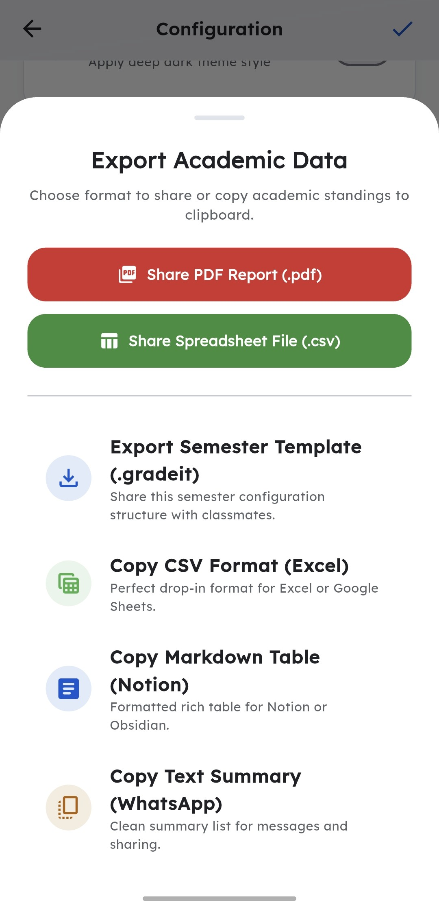
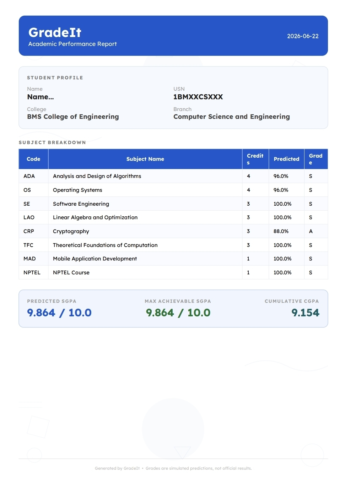

<div align="center">
  

  <br />
  <br />

# 🎓 GradeIt

**Your Smart Academic Performance Predictor & Manager**

  <p align="center">
    <a href="https://flutter.dev/"></a>
    <a href="https://dart.dev/"></a>
    <a href="#"></a>
  </p>

  <p align="center">
    <em>Predict, Analyze, and Export your academic journey with ease.</em>
  </p>
</div>

---

## 🌟 Introduction

**GradeIt** is a highly intuitive, beautifully designed academic tracking application built with Flutter. Designed for college and university students, GradeIt eliminates the guesswork from your semester. Define your grading scheme, input your current progress, and let GradeIt dynamically predict your SGPA, track your CGPA, and export stunning PDF reports of your performance.

## 🚀 Features

- **📊 SGPA & CGPA Forecasting:** Accurately predict your semester performance based on current component scores and custom grading schemes.
- **⚙️ Dynamic Configuration Wizard:** Setup your exact university grading boundaries and subjects via an interactive, step-by-step wizard.
- **📄 Beautiful PDF Exports:** Generate detailed, aesthetically pleasing academic reports featuring Lexend typography and structured tables, ready to be shared.
- **🌗 Dark & Light Mode:** Seamlessly switch between a clean light mode and a deep, eye-friendly dark mode. (Ships with Light Mode by default!)
- **💾 Local Storage Persistence:** All your configurations, profiles, and subject predictions are stored securely on-device using `SharedPreferences`.

---

## 📸 Screenshots

_Drop your screenshots in the `assets/screenshots/` folder and name them as listed below to magically see them appear here!_

<table align="center">
  <tr>
    <td align="center">
      <b>Dashboard Overview</b><br>
      <br>
      <sub><code>dashboard.png</code></sub>
    </td>
    <td align="center">
      <b>Semester Wizard</b><br>
      <br>
      <sub><code>wizard.png</code></sub>
    </td>
    <td align="center">
      <b>Grading System Setup</b><br>
      <br>
      <sub><code>gradingsystemsetup.png</code></sub>
    </td>
  </tr>
  <tr>
    <td align="center">
      <b>Profile & Settings</b><br>
      <br>
      <sub><code>settings.png</code></sub>
    </td>
    <td align="center">
      <b>Share & Export</b><br>
      <br>
      <sub><code>sharing.png</code></sub>
    </td>
    <td align="center">
      <b>PDF Output</b><br>
      <br>
      <sub><code>pdfoutput.png</code></sub>
    </td>
  </tr>
</table>

---

## 🧭 Interactive Tour

<details>
<summary><b>✨ How Does the Forecasting Work?</b> (Click to expand)</summary>
<br>
GradeIt uses your custom-defined grading boundaries (like assigning 90-100 for an 'S' grade) combined with the weighted averages of your subject components (Midterms, Assignments, Finals). It instantly recalculates your <b>Predicted SGPA</b> and <b>Max Achievable SGPA</b> every time you tweak a score!
</details>

<details>
<summary><b>📄 What's inside the PDF Report?</b> (Click to expand)</summary>
<br>
The generated PDF isn't just plain text! It uses the beautiful <b>Lexend</b> font, features a subtle geometric doodle background, and displays a completely structured table of your subject predictions alongside your calculated SGPA and CGPA. It's ready to print or share natively via iOS/Android share sheets.
</details>

---

## 🛠️ Built With

- **Framework:** [Flutter](https://flutter.dev) (Dart)
- **Design System:** Custom Google Material 3 (M3)
- **State Management:** Provider
- **PDF Generation:** [pdf](https://pub.dev/packages/pdf)
- **Local Storage:** [shared_preferences](https://pub.dev/packages/shared_preferences)

## 🗂️ Project Structure

```text
lib/
├── core/
│   ├── theme.dart            # Material 3 Color palettes and theme configurations
│   └── grading_calculator.dart # Core logic for score to grade mapping
├── models/
│   ├── generic_component.dart # Individual assignment/exam weights
│   ├── grade_scheme.dart      # Custom boundary mappings (e.g. S, A, B, C)
│   ├── semester.dart          # High-level semester logic
│   ├── subject.dart           # Subject-level calculations
│   └── user_profile.dart      # Profile info and previous CGPA data
├── screens/
│   ├── dashboard_screen.dart  # Main overview and entry point
│   ├── onboarding_screen.dart # First-time user introduction
│   ├── profile_screen.dart    # User USN and prior data setup
│   ├── semester_wizard_screen.dart # Setup exact subjects and components
│   └── subject_detail_screen.dart  # Deep-dive into specific subject scores
├── services/
│   ├── academic_provider.dart # Central state management
│   └── storage_service.dart   # On-device data persistence
└── widgets/
    └── academic_data_helper.dart # UI helpers, validation alerts, and PDF generator
```

## 💻 Getting Started

### Prerequisites

- Flutter SDK (3.x or higher)
- Dart SDK

### Installation

1. Clone the repository:
   ```bash
   git clone https://github.com/yourusername/gradeit.git
   ```
2. Navigate to the project directory:
   ```bash
   cd gradeit
   ```
3. Install dependencies:
   ```bash
   flutter pub get
   ```
4. Run the app:
   ```bash
   flutter run
   ```

---

<div align="center">
  <sub>Built with ❤️ for better grades.</sub>
</div>
